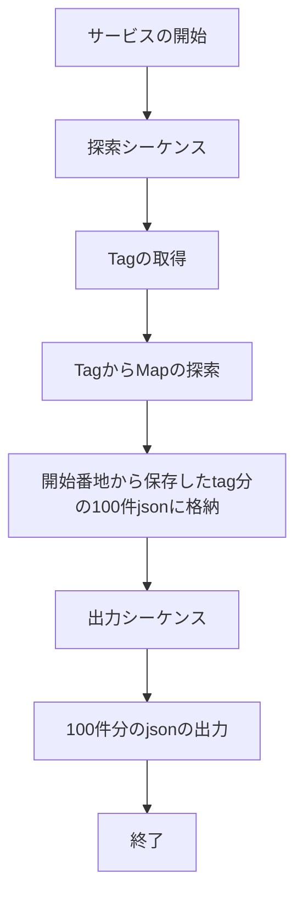

## Urlの?tag={}から受け取った内容を基にcsvの探索を行うサーバーを立てる

### 仕様
- 検索用のタグはurlから受け取る事

- 探索するcsvの形式

time|latitude|longitude|url|tag
----|----|----|----|----
string|string|string|string|string

- 探索の流れ

```mermaid
graph TD;
    st[サービスの開始]-->sb1;
    sb1[探索シーケンス]-->op;
    op[Tagの取得]-->op1;
    op1[TagからMapの探索]-->op2;
    op2[開始番地から保存したtag分の100件jsonに格納]-->sb2;
    sb2[出力シーケンス]-->io1;
    io1[100件分のjsonの出力]-->e[終了];
```

